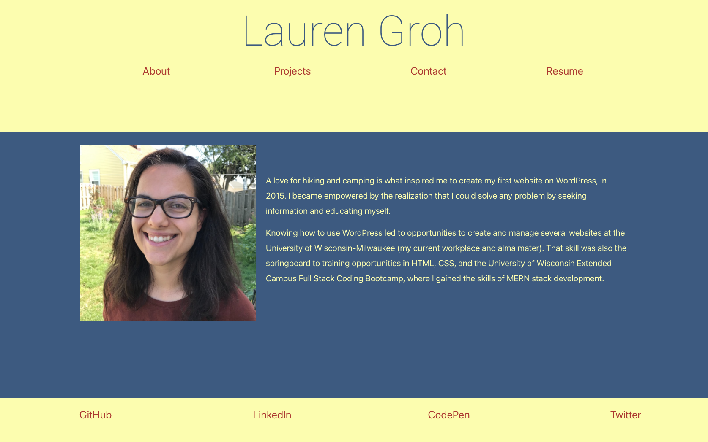
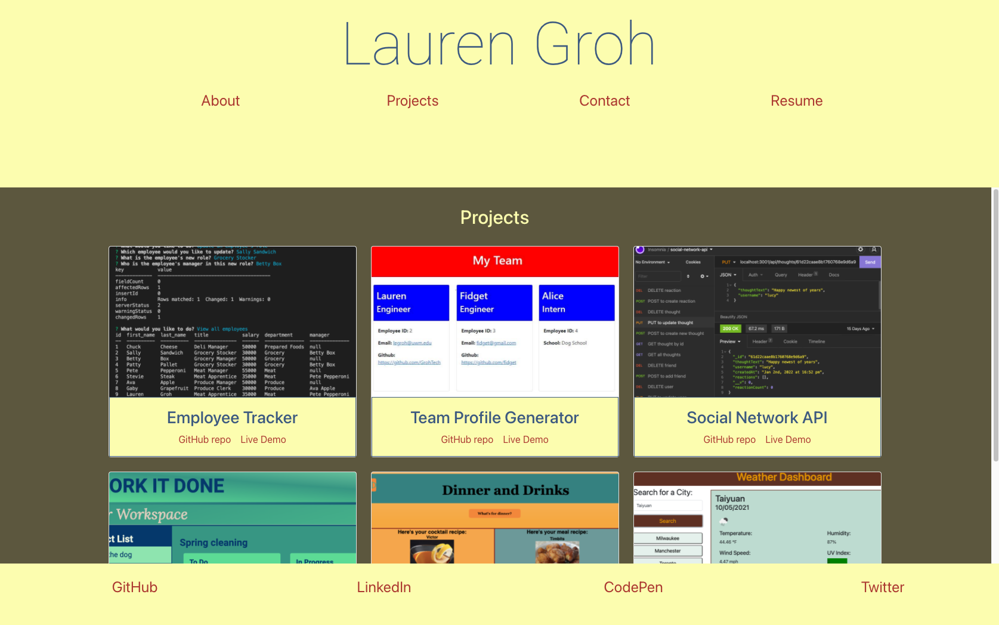

# React Portfolio

## Description 

This is my professional portfolio built with React.js, Node.js, and Bootstrap. It can also be used as a template for a different user's portfolio.

* **[View the Live Portfolio](https://grohtech.github.io/react-portfolio/)**
  
## Table of Contents 
* [Installation](#installation)
* [Instructions](#instructions)
* [Languages & Tools](#languages-tools)
* [Credits](#credits)
* [Contributions/Forks](#contributions/forks)
* [Questions](#questions)




  
## Installation

Users will need Node.js and React.js.
  
## Instructions 

Clone repository:
```
git clone <repository link>
```
Add all dependencies:
```
npm install
```
Initiate the app:
```
npm start
```

1. Your project will open in a new browser page.
2. The page will reload as you make changes in your code editor.
3. Check the console for errors.
4. Use ```ctrl``` + ```c``` to stop the React app.


## Languages & Tools

* JavaScript
* Node.js
* React.js

## Credits

1. Lauren Groh 
2. Help from UW Extended Campus Trilogy bootcamp tutor Ismael Lopez and Trilogy materials.

## Contributions/Forks

Contributions won't be accepted for this project, but please feel free to fork or clone the project for personal use. I would appreciate credit back to my [GitHub Profile](https://github.com/GrohTech). Thank you!

## Questions

If you have any questions please connect with me through [GitHub](https://github.com/GrohTech) or [legroh@uwm.edu](mailto:legroh@uwm.edu).
